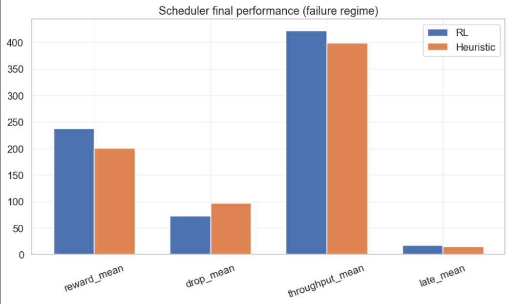

# DRL Cloud Workload Scheduler 🚀

This project documents the engineering pipeline and deployment of a **Deep Reinforcement Learning (Deep RL)** agent dedicated to intelligent workload scheduling within a heterogeneous and stochastic cloud cluster.

The primary goal is to outperform traditional heuristics (such as the Greedy / Least-Loaded approach) by designing a policy capable of anticipating hardware fatigue and preventing long-term server failures (_self-healing infrastructure_), all while protecting Service Level Agreements (**SLA**).

---

## 🌟 Key Features

- **Custom Gymnasium Environment:** Simulation of a cluster with stochastic job arrivals (Poisson distribution), dynamic queues (_backlog_), and a custom non-Markovian phenomenological model for thermal fatigue and server failure.
- **Training & Optimization (HPO):** : Trained a Proximal Policy Optimization (PPO) agent and optimized its training parameters to eliminate instabilities and ensure smooth, reliable learning.
- **Automated Reward Shaping with Optuna:** Automated hyperparameter search for the reward function weights to mathematically balance maximum global throughput against critical hardware safety.
- **Production Evaluation (2M Steps):** The final PPO model achieves a **$+18.54\%$ in average episodic reward** over the heuristic under high-stress failure conditions, while simultaneously reducing dropped jobs by **$24.98\%$**, increasing throughput by **$+23.73$ jobs per episode**, and improving SLA compliance with late jobs stabilizing at **$17.87$** — all with zero queue stagnation.



---

## 📂 Project Structure

```bash
├── runs_scheduler_final/      # TensorBoard logs for the final training run
├── DRL_workload_scheduler.ipynb # Main notebook containing all experiments
├── requirements.txt           # Required dependencies to run the project
└── README.md                  # Project documentation
```

---

## 🛠️ Installation & Prerequisites

### 1. Clone the Repository

Open your terminal and run the following command to clone the project:

```Bash
git clone [https://github.com/KhadijaOuf/DRL-workload-scheduler.git](https://github.com/KhadijaOuf/DRL-workload-scheduler.git)
cd DRL-workload-scheduler
```

### 2. Create a Virtual Environment (Recommended)

It is highly recommended to isolate the dependencies inside a Python virtual environment:

```Bash
# On Windows
python -m venv venv
.\venv\Scripts\activate

# On Linux/MacOS
python3 -m venv venv
source venv/bin/activate
```

### 3. Install Dependencies

Install all the required libraries:

```Bash
pip install -r requirements.txt
```

## 📊 Usage & Visualization

To explore the code, view the environment design, run sensitivity studies, or test the Optuna optimization, launch Jupyter:

```Bash
jupyter notebook DRL_workload_scheduler.ipynb
Launch TensorBoard
```

To analyze the agent's convergence curves (Value Loss, Explained Variance) as well as the custom business metrics, run:

```Bash
# To visualize the specific final run
tensorboard --logdir=runs_scheduler_final

# Or to compare all runs in the current directory
tensorboard --logdir=.
```

Once TensorBoard initializes, open your browser and navigate to the provided local address (usually http://localhost:6006/).

### ⚠️ Project Limitations & Future Work

- **Single-Agent Sequential Bottleneck:** The agent currently processes only one job per timestep.
- **High Parameter Sensitivity:** The failure dynamics rely heavily on fixed initial constants (arrival_lambda and crash probabilities).
- **The Reality Gap:** The environment remains a simplified abstraction of a production cluster (lacking complex network latency and fine-grained hardware heterogeneity).
